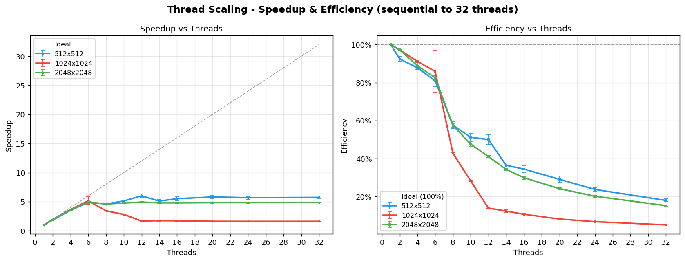
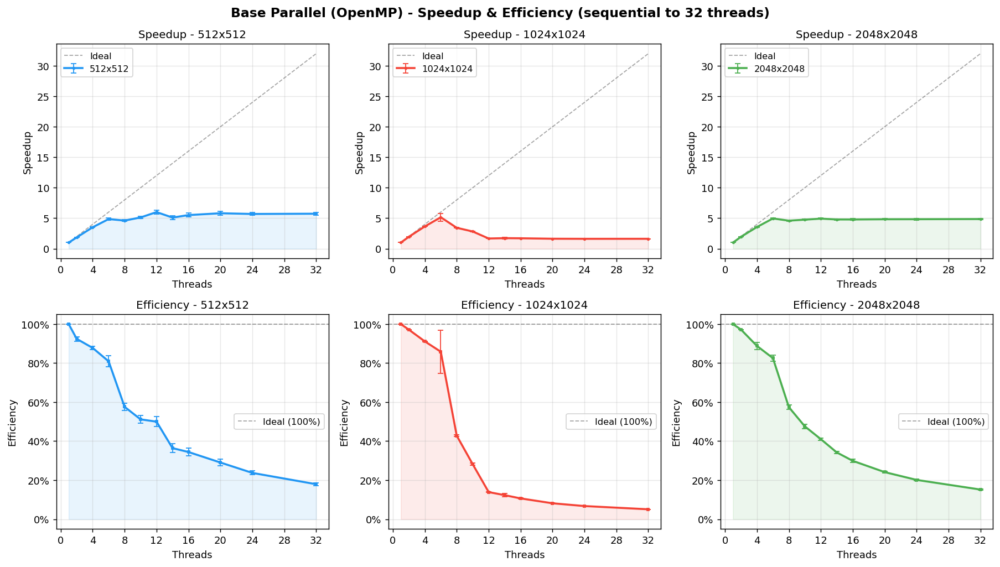
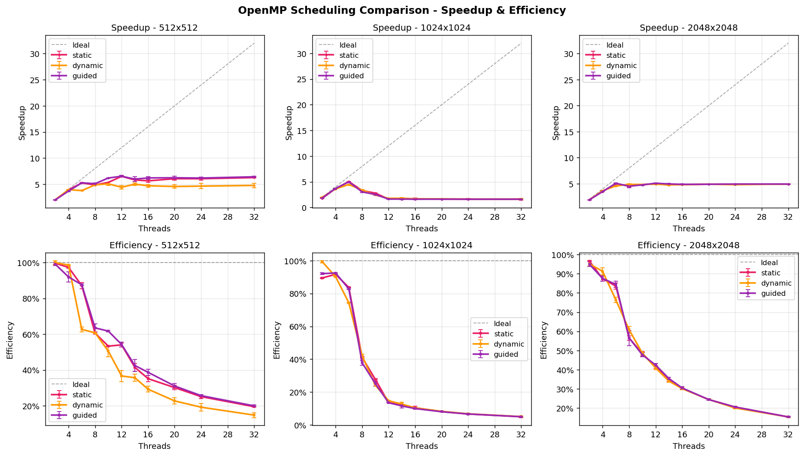
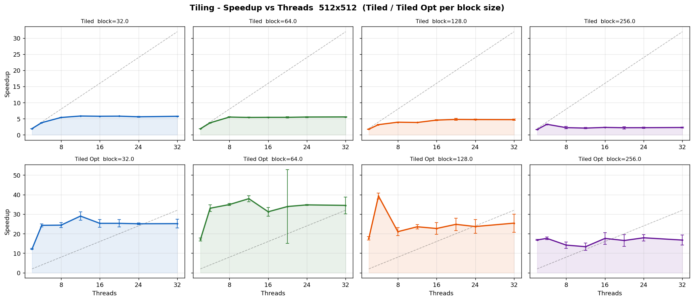
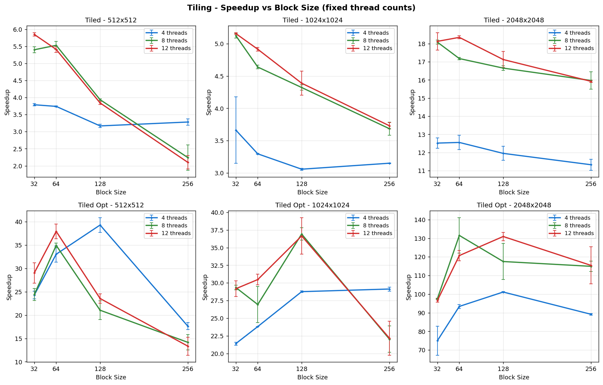
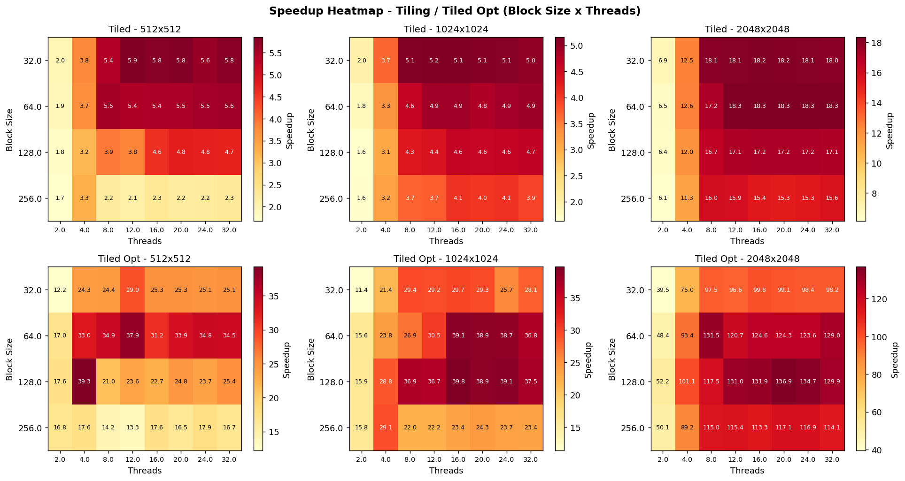
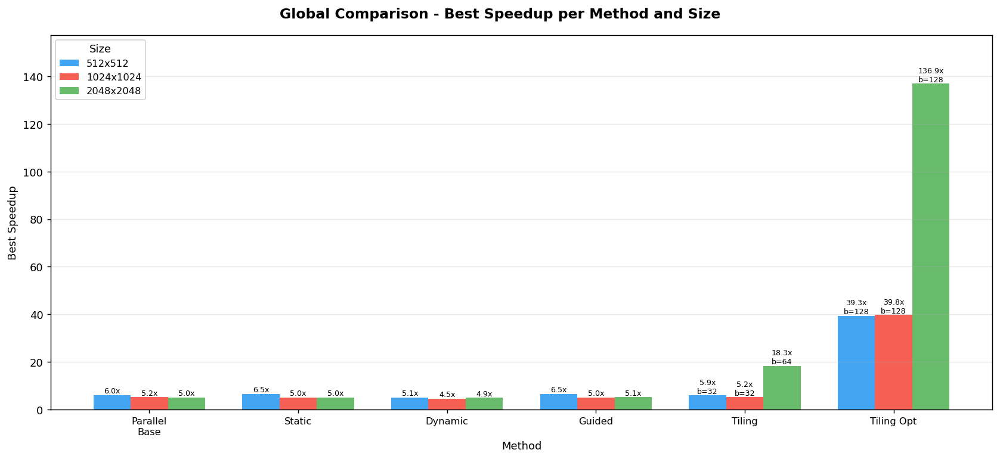
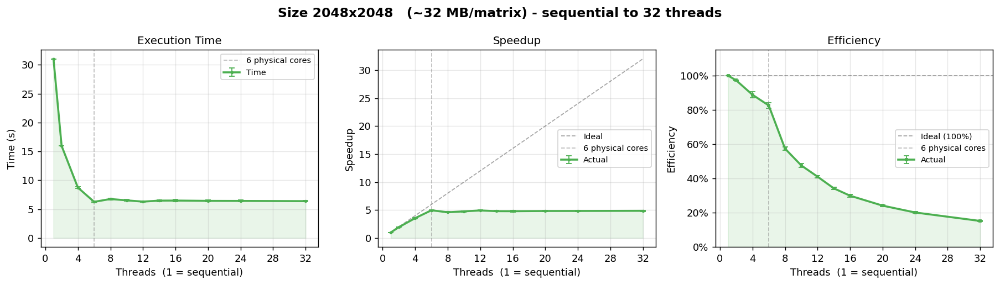

# OpenMP Matrix Multiplication Benchmark

A benchmarking suite for dense matrix-matrix multiplication in C++ using OpenMP, comparing a sequential baseline against several parallelization strategies: basic parallel loops, different OpenMP scheduling policies (`static`, `dynamic`, `guided`), and cache-blocking (tiling), including a memory-access-optimized tiled variant.

## Project structure

```
.
├── matmul1.cpp      # Benchmark implementation (all multiplication variants + CLI driver)
├── Makefile         # Build and test automation
├── plot_all.py       # Generates all plots from the results CSVs
└── results/
    ├── results.csv              # Size vs threads (base parallel)
    ├── scheduling_results.csv   # static / dynamic / guided comparison
    ├── tiling_results.csv       # Tiled and tiled_opt, block size vs threads
    ├── thread_scaling.csv       # Thread scaling study
    └── plots/                   # Generated PNG figures
```

## Requirements

- A C++ compiler with OpenMP support (`g++` recommended)
- Python 3 with `pandas`, `numpy`, and `matplotlib` (for plotting)

## Building and running

```bash
make              # build the matmul1 executable
make run          # run with default settings (size=512, threads=8)
make verify       # correctness check against the sequential result
```

### Benchmark suites

```bash
make test              # size vs threads          -> results/results.csv
make test-scheduling   # static/dynamic/guided     -> results/scheduling_results.csv
make test-tiling       # tiled                     -> results/tiling_results.csv
make test-tiling-opt   # tiled_opt (appended)       -> results/tiling_results.csv
make thread-scaling    # thread scaling study       -> results/thread_scaling.csv
make full-test         # runs all of the above
```

Run `make help` for the full list of targets and manual invocation examples.

## Generating the plots

Once the CSV files exist under `results/`:

```bash
pip install pandas numpy matplotlib
python plot_all.py
```

Figures are written to `results/plots/`.

## Results

### Thread scaling (speedup & efficiency, sequential → 32 threads)



### Base parallel: speedup & efficiency per matrix size



### OpenMP scheduling comparison (static / dynamic / guided)



### Tiling: speedup vs threads per block size (512×512)



### Tiling: effect of block size at fixed thread counts



### Tiling speedup heatmap (block size × threads)



### Global comparison: best speedup per method and size



### Per-size detail (execution time, speedup, efficiency)



Additional per-size plots (512, 850, 1024, 1520) and the split parallel-time views (`8a`, `8b`) are available in `results/plots/`.

## Notes

- Each parallel data point is the median of multiple runs, with `STDDEV` reporting the run-to-run standard deviation of the parallel time; that stddev is propagated into the speedup/efficiency error bars shown in the plots.
- Correctness is verified by comparing the parallel result against the sequential one within a `1e-3` tolerance.
